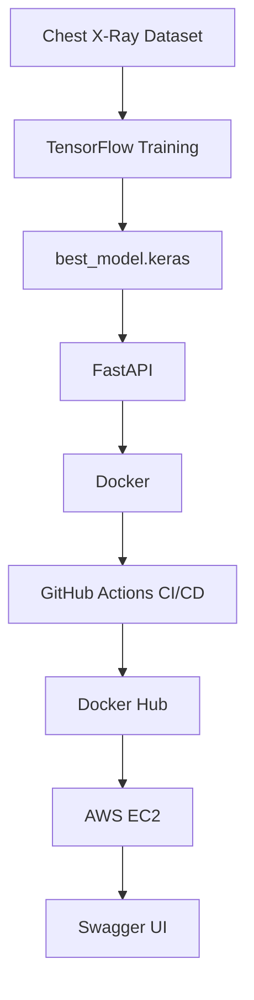
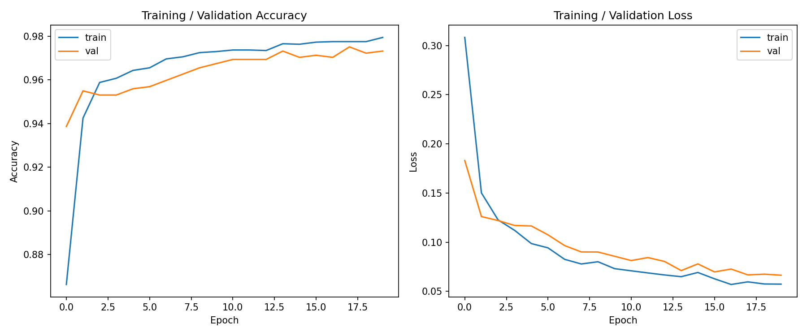
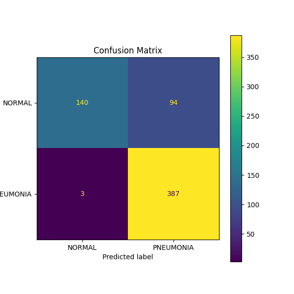
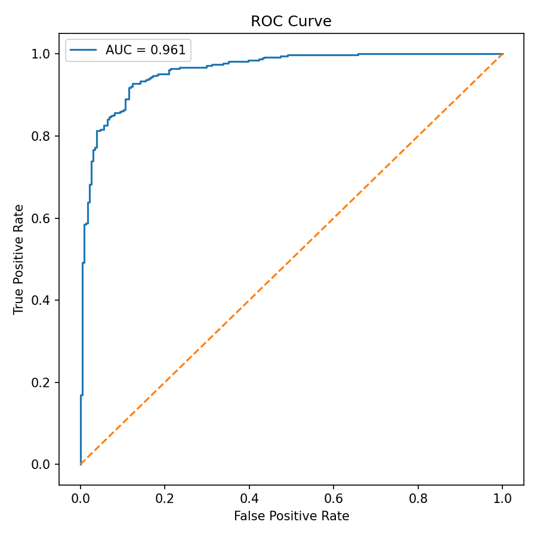
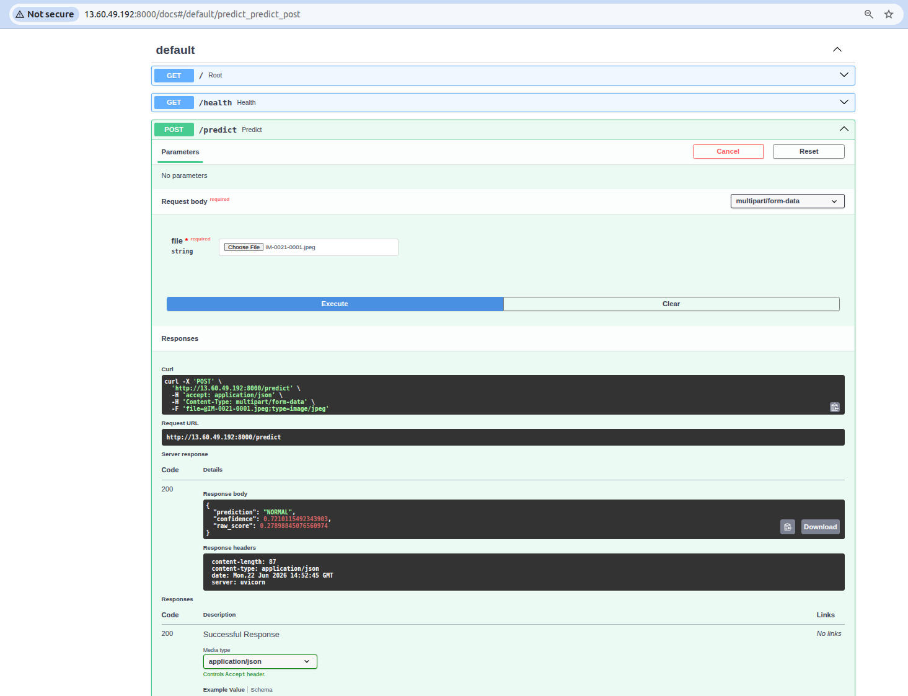

# 🩻 Chest X-Ray Pneumonia Classification


[](https://github.com/AliaChe/xray_classification/actions/workflows/docker.yml)

An end-to-end **MLOps project** for automated pneumonia detection from chest X-ray images using **TensorFlow**, **FastAPI**, **Docker**, **GitHub Actions**, and **AWS EC2**.

The project demonstrates the complete machine learning lifecycle, from data exploration and model training to cloud deployment with automated CI/CD.

---

# Table of Contents

## Table of Contents

- [Overview](#overview)
- [Project Architecture](#project-architecture)
- [Quick Start](#quick-start)
- [Tech Stack](#tech-stack)
- [Dataset](#dataset)
- [Model Architecture ](#model-architecture)
- [Model Performance](#model-performance)
- [Project Structure](#project-structure)
- [Installation](#installation)
- [Training](#training)
- [Dataset Inspection](#dataset-inspection)
- [Inference](#inference)
- [FastAPI API](#fastapi-api)
- [Docker](#docker)
- [Docker Hub](#docker-hub)
- [AWS Deployment](#aws-deployment)
- [CI/CD](#cicd)
- [Project Status](#project-status)
- [Future Improvements](#future-improvements)
- [License](#license)

---

# Overview

This project classifies chest X-ray images into two classes:

- NORMAL
- PNEUMONIA

using a transfer learning approach based on **MobileNetV2**.

Beyond model training, the objective is to build a production-ready machine learning application including:

- model serving
- REST API
- Docker containerization
- automated testing
- CI/CD
- cloud deployment

---

# Project Architecture


---

# Quick Start

```bash
git clone https://github.com/alia123/xray_classification.git

cd xray_classification

pip install -r requirements/dev.txt

uvicorn app.main:app --reload
```

Open:

```
http://localhost:8000/docs
```

# Tech Stack

| Category | Technologies |
|-----------|--------------|
| Deep Learning | TensorFlow, Keras |
| Backend | FastAPI |
| API Documentation | Swagger UI |
| Containerization | Docker |
| Cloud | AWS EC2 |
| CI/CD | GitHub Actions |
| Testing | Pytest |
| Linting | Ruff |
| Data Science | NumPy, Matplotlib, Scikit-learn |
| Configuration | YAML |
| Version Control | Git, GitHub |

---

# Dataset

Dataset: **Chest X-Ray Images (Pneumonia)**

Structure:

```text
data/raw/chest_xray/
├── train/
│   ├── NORMAL/
│   └── PNEUMONIA/
├── test/
│   ├── NORMAL/
│   └── PNEUMONIA/
└── val/
    ├── NORMAL/
    └── PNEUMONIA/
```

Training set distribution:

| Class     | Images |
| --------- | -----: |
| NORMAL    |  1,341 |
| PNEUMONIA |  3,875 |

The dataset is highly imbalanced, with approximately 74% pneumonia images.

---

# Model Architecture

## Architecture

- MobileNetV2 (ImageNet pretrained)
- Transfer Learning
- GlobalAveragePooling2D
- Dropout
- Dense(1, sigmoid)

## Training

- TensorFlow / Keras
- Binary Cross-Entropy
- Adam Optimizer
- EarlyStopping
- ModelCheckpoint
- Class Weights

---

# Model Performance
<h2>Training Curves</h2>

<p align="center">
  
</p>

<h2>Confusion Matrix</h2>

<p align="center">
  
</p>

<h2>ROC Curve</h2>

<p align="center">
  
</p>


## Classification Report

```text
              precision    recall  f1-score   support

NORMAL            0.96      0.60      0.74       234
PNEUMONIA         0.80      0.98      0.88       390

accuracy                              0.84       624
macro avg         0.88      0.79      0.81       624
weighted avg      0.86      0.84      0.83       624
```

### Key observations

- High pneumonia recall (98%)
- Good overall accuracy (84%)
- Strong sensitivity for pneumonia detection
- Slight tendency to over-predict pneumonia due to dataset imbalance

---

# Project Structure

```text
.
├── app/
├── configs/
├── data/
├── images/
├── notebooks/
├── requirements/
│   ├── base.txt
│   ├── dev.txt
│   ├── prod.txt
│   └── train.txt
├── saved_models/
├── scripts/
├── src/
├── tests/
└── Dockerfile
```

---

# Installation

Clone the repository:

```bash
git clone https://github.com/<username>/xray_classification.git

cd xray_classification
```

Development environment:

```bash
pip install -r requirements/dev.txt
```

Training environment:

```bash
pip install -r requirements/train.txt
```

---

# Training

Train the model:

```bash
python -m src.train
```

The trained model is saved as:

```text
saved_models/best_model.keras
```
> **Note:** If `saved_models/best_model.keras` is missing, run the training command above before using the inference script, the FastAPI application, or building the Docker image.

---

# Dataset Inspection

```bash
python -m scripts.inspect_dataset
```

Current inspection includes:

- class distribution
- sample visualization
- image dimensions
- dataset sanity checks

---

# Inference

The project includes a standalone inference pipeline for predicting pneumonia from a single chest X-ray image.

Run:

```bash
python -m src.predict path/to/image.jpeg
```

Example:

```bash
python -m src.predict data/raw/chest_xray/test/PNEUMONIA/person1_virus_6.jpeg
```

Output:

```text
Prediction : PNEUMONIA

Confidence : 94.2%

Raw score : 0.9421
```

### Inference Pipeline

```text
Chest X-ray Image
        │
        ▼
Resize (224 × 224)
        │
        ▼
MobileNetV2 preprocessing
        │
        ▼
TensorFlow Model
        │
        ▼
Sigmoid probability
        │
        ▼
NORMAL / PNEUMONIA
```

The inference pipeline applies the same preprocessing steps used during training, ensuring consistency between training and inference.

---

# FastAPI API

Launch locally:

```bash
uvicorn app.main:app --reload
```

Swagger UI:

```
http://localhost:8000/docs
```

## Endpoints

| Method | Endpoint | Description |
|---------|----------|-------------|
| GET | / | Welcome message |
| GET | /health | Health check |
| POST | /predict | Predict pneumonia |

Input validation includes:

- image validation
- empty file validation
- automatic temporary file cleanup

---

# Docker

Build:

```bash
docker build -t xray-api .
```

Run:

```bash
docker run -p 8000:8000 xray-api
```

Swagger:

```
http://localhost:8000/docs
```

---

# Docker Hub

The production image is published on Docker Hub.

```bash
docker pull alia123/xray-api:latest
```

Run directly:

```bash
docker run -p 8000:8000 alia123/xray-api:latest
```

---

# AWS Deployment

The application is deployed on an AWS EC2 instance using Docker.

Deployment pipeline:

```text
Training
    │
best_model.keras
    │
Docker Image
    │
Docker Hub
    │
AWS EC2
    │
FastAPI
```

Swagger running on EC2:



---

# CI/CD

Every push to the `master` branch automatically triggers the deployment pipeline.

```text
Git Push
    │
    ▼
GitHub Actions
    │
    ├── Install dependencies
    ├── Ruff
    ├── Format check
    ├── Pytest
    ├── Docker Build
    ├── Docker Push
    └── Deploy to AWS EC2
```

Only if every validation step succeeds is the Docker image published and automatically deployed to the production EC2 instance.

---

# Project Status

| Component | Status |
|-----------|:------:|
| Data Exploration | ✅ |
| Model Training | ✅ |
| Model Evaluation | ✅ |
| Inference | ✅ |
| FastAPI | ✅ |
| Docker | ✅ |
| Docker Hub | ✅ |
| AWS EC2 | ✅ |
| CI | ✅ |
| CD | ✅ |
| MLflow | ⏳ |
| Model Registry | ⏳ |
| Monitoring | ⏳ |

---

# Future Improvements

## Machine Learning

- Perform detailed error analysis.
- Experiment with data augmentation strategies.
- Fine-tune the MobileNetV2 backbone.
- Optimize the decision threshold to improve the precision-recall trade-off.
- Evaluate additional CNN architectures (EfficientNet, DenseNet, ConvNeXt).

## MLOps

- MLflow experiment tracking
- Model Registry
- Automatic model versioning
- Custom domain with HTTPS
- Nginx reverse proxy
- Monitoring (Prometheus / Grafana)
- TensorFlow Serving

---

# License

MIT License.