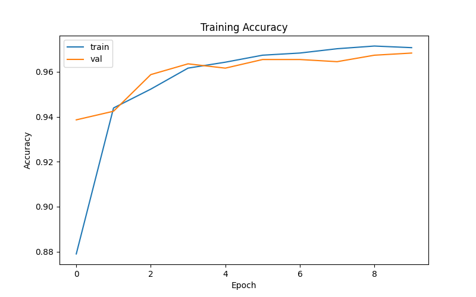

# Pneumonia Detection from Chest X-Rays

Deep learning project for binary classification of chest X-ray images:

- NORMAL
- PNEUMONIA

The goal is to build a robust medical image classification pipeline using TensorFlow and transfer learning.

---

## Dataset

Dataset:

- Chest X-Ray Pneumonia Dataset (Kaggle)

Classes:

- NORMAL
- PNEUMONIA

Directory structure:

```text
data/raw/chest_xray/
├── train/
│   ├── NORMAL/
│   └── PNEUMONIA/
├── test/
│   ├── NORMAL/
│   └── PNEUMONIA/
└── val/
    ├── NORMAL/
    └── PNEUMONIA/
```

---

## Project Structure

```text
.
├── configs
│   └── config.yaml
├── data
│   └── raw
├── images
├── notebooks
│   └── exploration.ipynb
├── saved_models
├── scripts
│   └── inspect_dataset.py
└── src
    ├── data
    │   └── load_data.py
    ├── models
    │   └── cnn_model.py
    ├── evaluate.py
    ├── train.py
    └── utils
        └── load_config.py
```

---

## Installation

Create a virtual environment:

```bash
python -m venv .venv
source .venv/bin/activate
```

Install dependencies:

```bash
pip install -r requirements.txt
```

---

## Dataset Exploration

Inspect the dataset:

```bash
python -m scripts.inspect_dataset
```

Current exploration includes:

- class distribution
- sample visualization
- image dimensions
- dataset sanity checks

---

## Training

Training script:

```bash
python -m src.train
```

Current model:

- TensorFlow
- MobileNetV2 (ImageNet pretrained)
- Binary classification head
- Transfer learning

---

## Current Status

### Completed

- [x] Dataset download and cleanup
- [x] Dataset exploration
- [x] TensorFlow dataloaders
- [x] Train / validation split
- [x] MobileNetV2 baseline architecture
- [x] First training run
- [x] Evaluation pipeline
- [x] Confusion matrix
- [x] Training curves

### In Progress

- [ ] Benchmarking
- [ ] Class Imbalance

---

## Results




## License

MIT